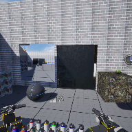

# Project Name  VRMod12Sample

## Description

A continuation of the in class demonstration code based on UE default Virtual Reality template. Added MyGameInstance, BP_Pedestal(s), and customized WidgetMenu.
 
## Usage
Clone, or download the zip, to a local directory. Open in Unreal Engine 5.4 or newer

## Attributions
1. Stone door , OpenGameArt, < https://opengameart.org/content/stone-door  >
2. Coin collected, OPenGameArt, < https://opengameart.org/content/gold-coin-6 >
3. Spray paint sound, OpenGameArt, < https://opengameart.org/content/yucchis-assorted-sounds-1 >
3. Background music, < https://pixabay.com/music/modern-classical-soft-background-piano-285589 >

